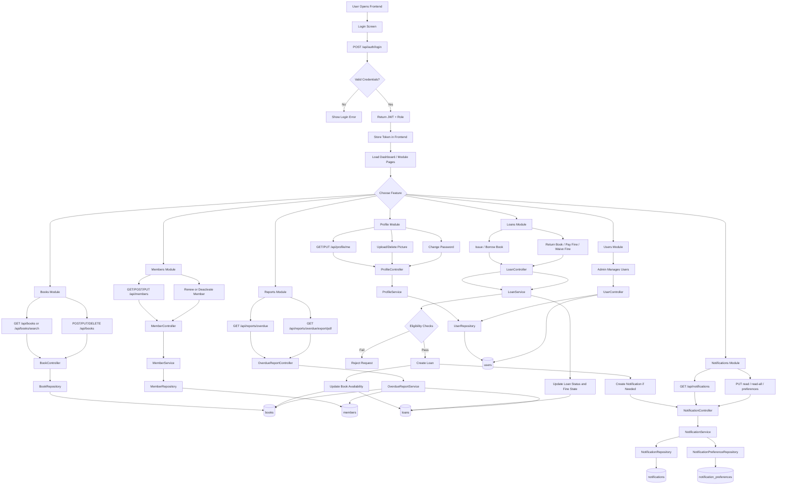
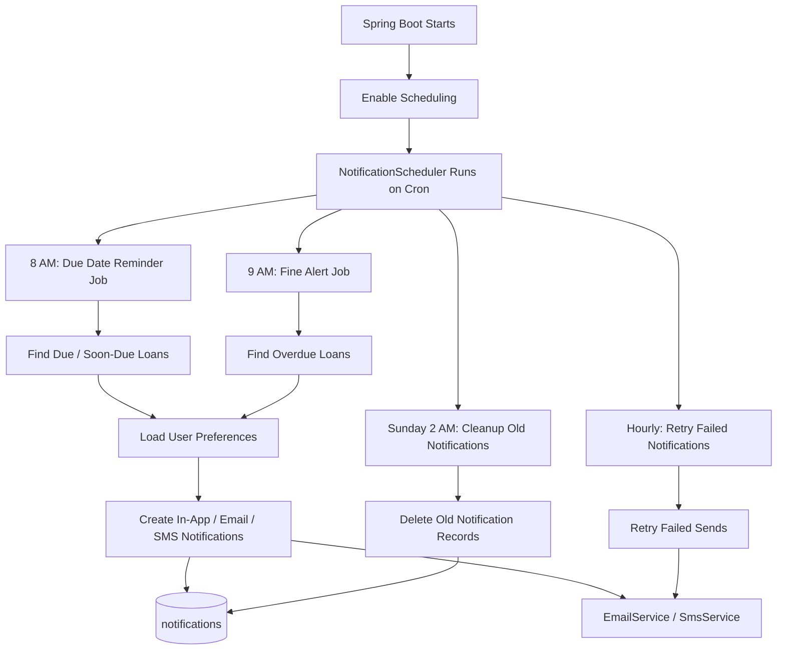

# Workflow Diagram
# Library Management System

## Main Application Workflow

## Background Scheduler Workflow

## Key Business Rules in Workflow

- Login returns a JWT, and protected APIs require `Authorization: Bearer <token>`.
- Loan creation checks member status, membership expiry, overdue books, unpaid fines, active loan count, and book availability.
- Returning a book updates loan state and may calculate or settle fines.
- Notification preferences control how reminders and alerts are sent.
- Admin-only flows include user role/status changes and fine waivers.
